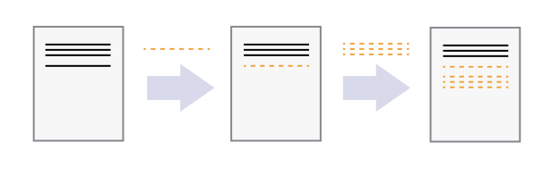
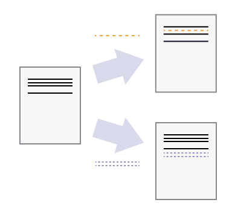
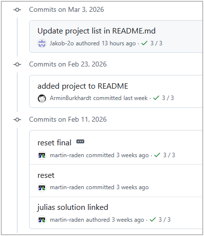
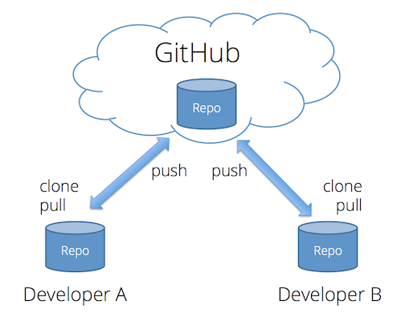
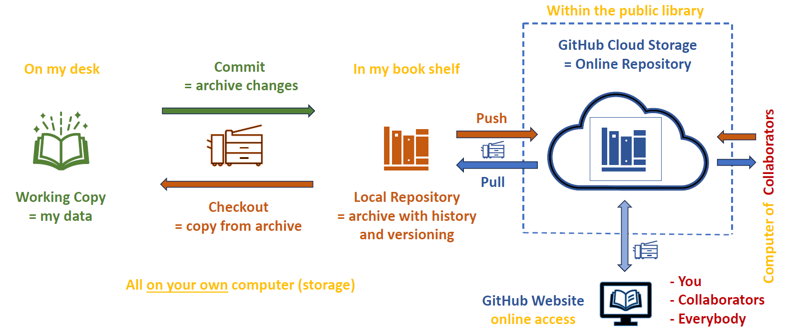
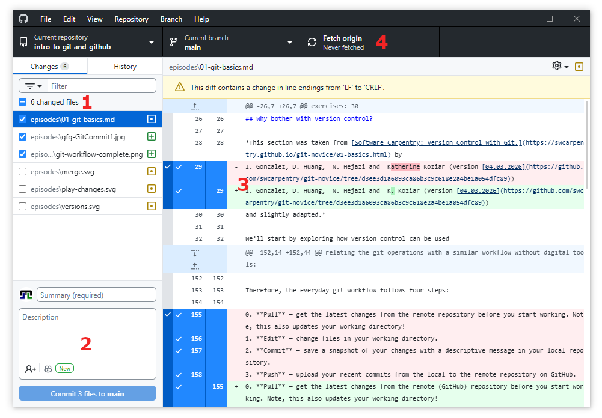
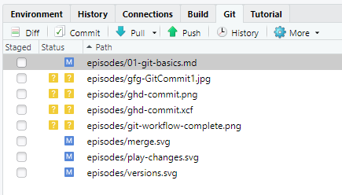
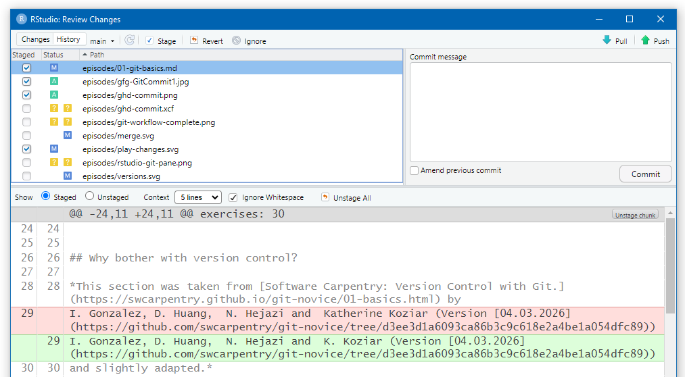

:::::::::::::::::::::::::::::::::::::: questions

- What is version control and why should I use it?
- What are the basic git concepts I need to know?
- How do I work with a repository on my own?

::::::::::::::::::::::::::::::::::::::::::::::::

::::::::::::::::::::::::::::::::::::: objectives

- Explain what git is and why version control matters
- Describe the difference between local and remote repositories
- Perform the core loop: edit → commit → push → pull
- Write meaningful commit messages
- Use a `.gitignore` file to exclude unwanted files

::::::::::::::::::::::::::::::::::::::::::::::::


## Why bother with version control?

*This section was taken from [Software Carpentry: Version Control with Git.](https://swcarpentry.github.io/git-novice/01-basics.html) by
I. Gonzalez, D. Huang,  N. Hejazi and  K. Koziar (Version [04.03.2026](https://github.com/swcarpentry/git-novice/tree/d3ee3d1a6093ca86b3c9c618e2a4be1a054dfc89))
and slightly adapted.*

We'll start by exploring how version control can be used
to keep track of what one person did and when.
Even if you aren't collaborating with other people,
automated version control is much better than this situation:

{alt='Comic: a PhD student sends "FINAL.doc" to their supervisor, but after several increasingly intense and frustrating rounds of comments and revisions they end up with a file named "FINAL_rev.22.comments49.corrections.10.#@$%WHYDIDCOMETOGRADSCHOOL????.doc"'}

We've all been in this situation before: it seems unnecessary to have
multiple nearly-identical versions of the same document. Some word
processors let us deal with this a little better, such as Microsoft
Word's
[Track Changes](https://support.office.com/en-us/article/Track-changes-in-Word-197ba630-0f5f-4a8e-9a77-3712475e806a),
Google Docs' [version history](https://support.google.com/docs/answer/190843?hl=en), or
LibreOffice's [Recording and Displaying Changes](https://help.libreoffice.org/Common/Recording_and_Displaying_Changes).

Version control systems start with a base version of the document and
then record changes you make each step of the way. You can
think of it as a recording of your progress: you can rewind to start at the base
document and play back each change you made, eventually arriving at your
more recent version.

{alt='A diagram demonstrating how a single document grows as the result of sequential changes' width="60%"}

Once you think of changes as separate from the document itself, you
can then think about "playing back" different sets of changes on the base document, ultimately
resulting in different versions of that document. For example, two users can make independent
sets of changes on the same document.

{alt='A diagram with one source document that has been modified in two different ways to produce two different versions of the document' width="40%"}

Unless multiple users make changes to the *same section* (i.e. text row) of the document - which would cause a 
[conflict](../learners/reference.md) - versioning systems can automatically
incorporate sets of non-conflicting changes into the same base document.

{alt='A diagram that shows the merging of two different document versions into one document that contains all of the changes from both versions' width="40%"}

And this is where git comes into the game!


## What Is Git?

](what-is-git.png){alt="git summary" width="80%"}

{alt="git logo" width="80px"} is a **version control system** — a tool that tracks changes to your files over time. 
Think of it as an "undo history" on steroids: you can go back to any
previous version, see exactly what changed, and even work on multiple versions
in parallel.

The following screenshot shows a git commit history with messages and timestamps. 
Each commit is a snapshot of the project at a point in time, allowing you to track the evolution of your work and understand the context of changes.

{alt="Git commit history showing a linear sequence of commits with messages and timestamps."}


::::::::::::::::::::::::::::::::::::: callout

### Why use version control?

- **Reproducibility:** every version of your work is saved and can be
  restored.
- **Collaboration:** multiple people can work on the same project without
  annihilating each other's changes.
- **Publishing:** share your work publicly or with a team.
- **Archiving:** keep a permanent, citable record of your project.

::::::::::::::::::::::::::::::::::::::::::::::::

## What Is GitHub?

{alt="GitHub logo" width="120px"} is a web platform that hosts git repositories online. It adds
collaboration features such as pull requests, issues, and project boards on
top of git's version control.

- **Git** = the version control engine (runs on your computer).
- **GitHub** = the hosting service (stores your repository in the cloud).


## Local vs Remote Repositories

Before we start working with git, it's important to understand the difference between the **local** and **remote** repositories:

| Term | Meaning |
|------|---------|
| **Local repository** | The copy of the project on *your* computer |
| **Remote repository** | The copy hosted on GitHub (often called **origin**) |

{alt="local and remote repositories with push and pull arrows." width="40%"}

When you **clone** a repository, you download the remote copy of the project to your machine.
From that point on, you will synchronise changes between the two copies using **push** (local → remote) and **pull** (remote → local) git actions.
The same can be done by multiple people working on the same project, allowing for collaboration based on a synchronised central remote repository.
This is one of the major advantages of using systems like git for file management.

## The Core Loop


::::::: callout

## Repository vs Working Directory

**Note:** the local repository kind of a local database of all the changes you make on all the files in your project.
It is controlled by git not the same as the files on your computer that you edit and work with!
In order to work with the files on your computer, git creates a **working directory** that is a copy of the project files at a specific point in time (the last commit).
When you make changes to the files, they are not automatically saved in the local repository until you **commit** them. 
This is an important distinction to understand as it allows you to control when and how your changes are recorded in the history of the project.

::::::::::::

In the end, the git workflow operates in three places:

1. **Working directory** — where you edit files on your computer.
2. **Local repository** — where your commits are stored on your computer.
3. **Remote repository** — where your commits are stored on GitHub.

The interchange between these three places can be illustrated as follows by
relating the git operations with a similar workflow without digital tools:

{alt="Diagram of the git workflow showing the working directory, local repository, and remote repository with arrows indicating the flow of changes." width="90%"}


Therefore, the everyday git workflow follows four steps:

0. **Pull** — get the latest changes from the remote (GitHub) repository before you start working. Note, this also updates your working directory!
1. **Edit** — change files in your working directory. *This is done with any tool and independent of git.*
2. **Stage** - select which of your files/changes you want to include in the next commit. This is an optional step that allows you to control how your commits are structured.
3. **Commit** — save a snapshot of your changes with a descriptive message in your local git repository.
4. **Push** — upload your recent commits from the local to the remote repository (on GitHub).

**We strongly recommend to start your daily work by pulling the latest changes from GitHub to ensure you are working with the most up-to-date version of the project and to minimise potential conflicts later on.**


::::::: callout

## Staging

Coming back to *staging* (step 2 in the list above).
By default, git will not automatically do version control for any of your files.
That is, *you have to explicitly tell git which files and changes you want to include into the repository!*
In git nomenclature, this is called *staging* a file for commit and is done with the `git add` command in the CLI or by checking the files in GitHub Desktop or your IDE.

{alt="git workflow including the staging step, showing the working directory, staging area, local repository, and remote repository with arrows indicating the flow of changes."}

The same holds for all changes you make to files that are already under version control: you have to stage the changes before they are included in the next commit.
This allows you to control how your commits are structured and to create small, focused commits that are easier to understand and review than large, monolithic commits.
Also you can "store" only some of your changes in a commit and keep the rest for later commits, which can be useful if you are working on multiple features or changes at the same time.


::::::::::::::

## The Core Loop in GitHub Desktop

So far you have seen how the git workflow operates in theory, but how do you actually do these steps in practice?

Eventually, git is a command-line tool and thus all operations are done within a
command-line interface (CLI) such as Terminal or (Git) Bash. This looks like this:

)](gfg-GitCommit1.jpg){alt="Screenshot of a Bash terminal showing git commands 'status' and 'commit' being executed." width="70%"}

This is very efficient and useful when your are already comfortable with the CLI, but it can be intimidating for beginners. 
Therefore, we will use GitHub Desktop, a graphical user interface (GUI) that allows you to perform git operations without typing commands.
The core loop of edit → stage → commit → push → pull can be done entirely within GitHub Desktop, which is more user-friendly for those new to git.
The Screenshot shows the GitHub Desktop interface for a repository with some changes to be staged for commit.

{alt="Screenshot of GitHub Desktop showing the Changes tab with a list of modified files and options to stage them for commit." width="90%"}

### (1) Staging Changes

Within the screenshot from above, you find in the upper left corner (highlighted by the red (1)) the **Changes** tab, which lists all the files that have been modified in your working directory since the last commit.
To stage a file for commit, simply check the box next to it.

The symbol on the right of the file name indicates the type of change: 

- a green plus means the file is new, 
- yellow dots indicate modified files, and 
- a red minus identifies a file that was deleted.

### (2) Reviewing Changes

You can also click on modified file names to see a visualization of the changes you made, which is highlighted by the red (2). 
Therein, added lines are in green and removed lines in red.

Note, since git works line by line, if you change a line, git will show the old version as removed and the new version as added, even if they are very similar.
In that case, detailed changes are highlighted in dark hue within the added and removed lines to show exactly what was changed, as shown in the example of the modified file in the screenshot above.

**It is recommended to always review your changes before staging and committing to ensure you are including the intended modifications and to catch any unintended changes.**


### (3) Committing staged changes

Once you have selected (staged) all files, you are ready to commit to your local repository.
This is done by writing a short, descriptive **Summary** (commit message) in the box at the bottom left (highlighted by the red (2)) and then clicking the **Commit to main** button.
The commit button itself shows the number of staged files for this commit as a final reminder of what you are about to commit.

Longer descriptions can be added in the box below the Summary, but it is recommended to keep the Summary concise and to the point, while using the description for more detailed explanations if necessary.

Once you click the commit button, the changes are saved in your local repository, along with your "commitment", i.e. your user information, time stamp, commit message, etc.


### (4) Pushing Changes

After committing, your changes are still only in your local repository on your computer. 
To share them with others or to have them available on GitHub, you need to **push** them to the remote repository.

This is done using the "remote" section in the toolbar at the top of GitHub Desktop, which is highlighted by the red (4) in the screenshot above.

There, you can

- **Fetch origin** to check if there are new commits on GitHub that you don't have locally yet (for example, if you made changes on GitHub via the web editor or if someone else pushed changes to the same repository).
  - Note: this does not change your local files within the working directory, it just checks for updates and shows you if there are new commits available on GitHub.
- **Pull origin** to fetch and merge those changes into your local repository and update your working directory with the latest version from GitHub.
  - Note: this has the potential to cause merge conflicts if there are changes on GitHub that conflict with your local changes, so it is recommended to pull before you start working to minimise this risk.
- **Push origin** to upload your local commits to GitHub so they are available in the remote repository and can be seen by others.
  - Note: you can only push commits that are already in your local repository, so you need to commit before you can push.


:::::::::::::::: spoiler

### Git workflow in Rstudio

Most programming IDEs (including RStudio) have built-in git support that allows you to perform the core workflow without leaving the IDE.
In RStudio, you can find the git pane in the upper right corner, which shows you the status of your files (modified, new, deleted) and allows you to stage, commit, and push changes to GitHub.

{alt="Screenshot of RStudio showing the git pane with modified files and options to stage, commit, and push changes."}

When you click on "Commit", a new window opens where you can review your changes, write a commit message, and commit to your local repository similar to the workflow described for GitHub Desktop. 
After committing, you can push your changes to GitHub using the "Push" button either in the commit dialog or in the git pane.

{alt="Screenshot of RStudio showing the commit dialog with staged changes and commit message box."}

::::::::::::::::::::::::


:::::::::::::::: spoiler

### CLI equivalents

```bash
# Clone a repository
git clone https://github.com/USERNAME/REPO.git

# Check what has changed
git status

# Stage changes for commit
git add filename.md      # stage a specific file
git add .                # stage all changes and new files

# Commit with a message
git commit -m "Add goals section to README"

# Push commits to GitHub
git push

# Pull changes from GitHub
git pull
```

::::::::::::::::::::::::

## Tracking Changes and History

Every commit is a snapshot in your project's timeline. You can browse the
history to see:

- **what** changed (which files, which lines),
- **when** it changed (date and time),
- **who** made the change, and
- **why** (the commit message).

### Viewing History in GitHub Desktop

1. Click the **History** tab in the left panel.
2. Select any commit to see the files that changed and the exact differences
   (green = added, red = removed).

<!-- TODO: add screenshot of the History tab in GitHub Desktop showing a diff -->

:::::::::::::::: spoiler

### CLI equivalents

```bash
# View commit history
git log --oneline

# Show details of a specific commit
git show abc1234

# Compare working directory with last commit
git diff
```

::::::::::::::::::::::::

## What Makes a Good Commit?

::::::::::::::::::::::::::::::::::::: callout

### Best practices for commits

- **Small and focused:** each commit should represent one logical change.
- **Clear message:** start with a short summary (≤ 50 characters), optionally
  followed by a blank line and more detail.
- **Commit often:** frequent small commits are easier to understand and undo
  than rare large ones.

**Good examples:**

- `Add project goals to README`
- `Fix typo in introduction section`

**Bad examples:**

- `Update files`
- `asdfgh`

::::::::::::::::::::::::::::::::::::::::::::::::

## Ignoring Files with `.gitignore`

Not every file belongs in a repository. Build outputs, temporary files, and
credentials should be excluded.

Create a file called `.gitignore` in the root of your repository and list the
patterns to ignore:

```text
# Compiled files
*.exe
*.o

# Editor backups
*~
*.swp

# OS files
.DS_Store
Thumbs.db

# Credentials — never commit these!
secrets.yaml
.env
```

:::::::::::::::: spoiler

### CLI equivalent

```bash
# Create a .gitignore file
echo "*.exe" > .gitignore
echo ".DS_Store" >> .gitignore

# Check which files are ignored
git status --ignored
```

::::::::::::::::::::::::

## Fetch vs Pull (Optional)

| Command | What it does |
|---------|-------------|
| **Fetch** | Downloads new data from the remote but does *not* change your local files. |
| **Pull** | Fetches *and* merges the remote changes into your current branch. |

In GitHub Desktop, clicking **Fetch origin** checks for updates. If there are
new commits, the button changes to **Pull origin**.

For more details, see
[Git fetch and merge](https://longair.net/blog/2009/04/16/git-fetch-and-merge/).

::::::::::::::::::::::::::::::::::::: challenge

## Exercise: Explain in Your Own Words

Write one or two sentences explaining each of the following terms:

1. **Commit**
2. **Push**
3. **Pull**

:::::::::::::::::::::::: solution

### Example answers

1. **Commit** — a saved snapshot of changes in my project, together with a
   message describing what I changed and why.
2. **Push** — uploading my local commits to the remote repository on GitHub so
   others (or other devices) can see them.
3. **Pull** — downloading and merging commits from the remote repository into
   my local copy so I have the latest changes.

:::::::::::::::::::::::::::::::::

::::::::::::::::::::::::::::::::::::::::::::::::

::::::::::::::::::::::::::::::::::::: keypoints

- Git is a version control system that tracks changes to files over time.
- GitHub hosts git repositories in the cloud and adds collaboration features.
- The core workflow is: **edit → commit → push → pull**.
- Good commits are small, focused, and have clear messages.
- Use `.gitignore` to keep unwanted files out of your repository.

::::::::::::::::::::::::::::::::::::::::::::::::
