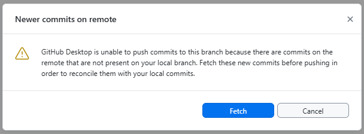
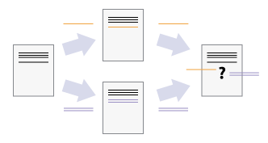
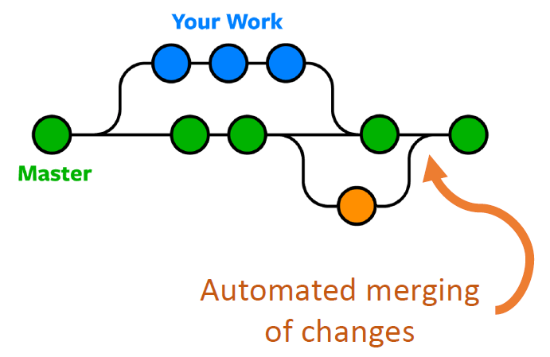
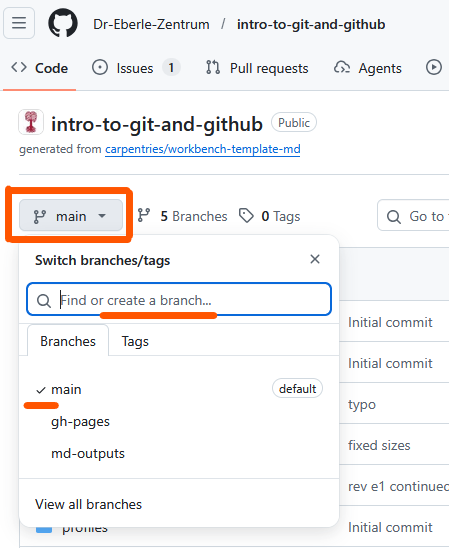
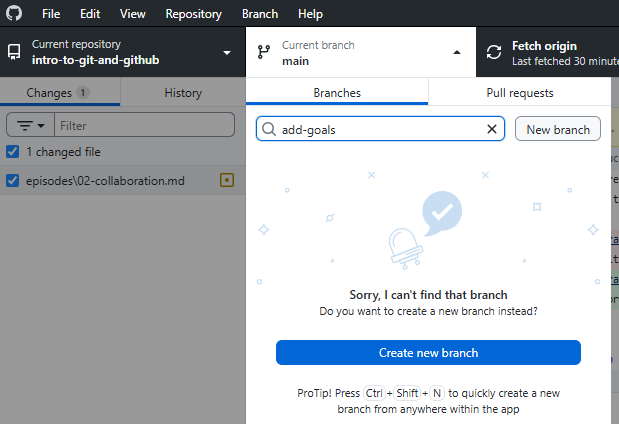
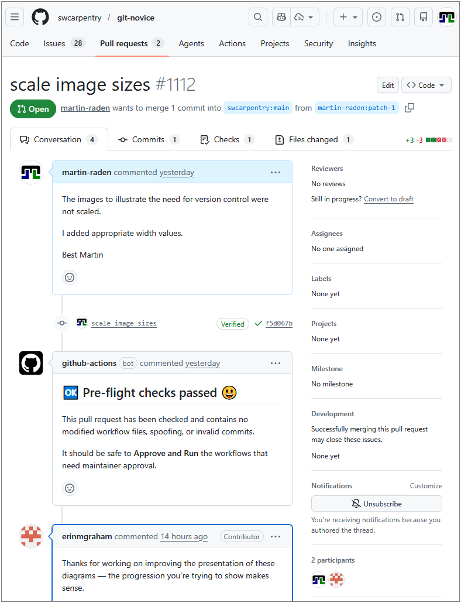
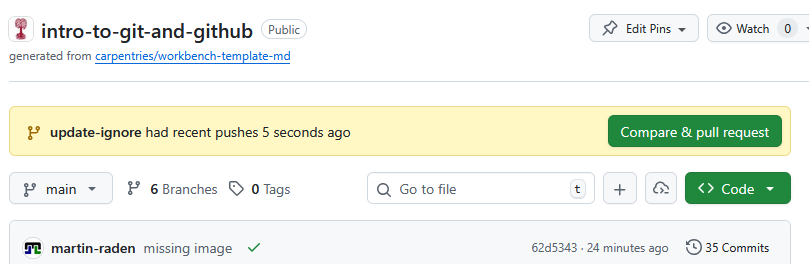
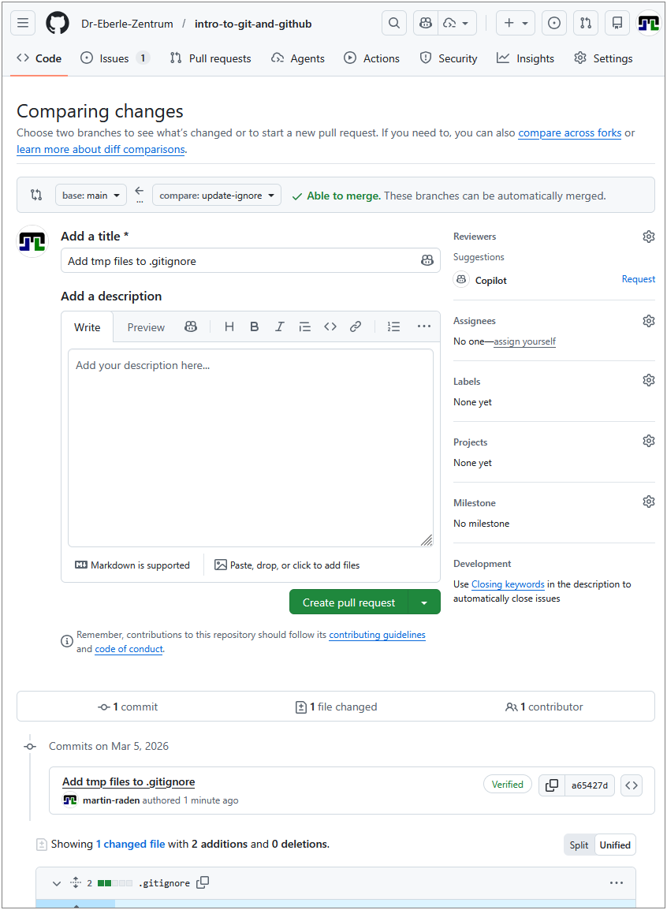
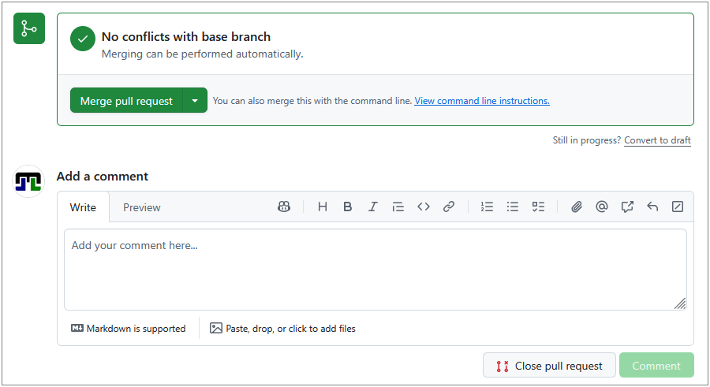

:::::::::::::::::::::::::::::::::::::: questions

- How can multiple people work on the same project without overwriting each
  other's changes?
- What is a branch and why should I use one?
- What is a pull request?

::::::::::::::::::::::::::::::::::::::::::::::::

::::::::::::::::::::::::::::::::::::: objectives

- Explain how concurrent changes are merged automatically
- Describe what a merge conflict is and when it occurs
- Create and switch between branches in GitHub Desktop
- Open a pull request on GitHub and request a review

::::::::::::::::::::::::::::::::::::::::::::::::

## Working Together on the Same Project

When you are not the sole contributor to a project, multiple people will be making
changes to the remote directory.
Thus, while you are working on your local copy, 
someone else might be changing the some files of the project on their local copy 
and pushing those changes to the remote repository.
When you are done with your changes and commited them to *your* local copy,
your local repository will be both outdated and ahead of the remote repository at the same time!

That is
- the remote repository has changes that you don't have (because someone else pushed them), and
- your local repository has changes that the remote repository doesn't have (because you haven't pushed them yet).

Therefore, git will refuse to push your changes until you have integrated the remote changes into your local copy.
When using GitHub Desktop, you will see the following notification.

{alt='A screenshot of GitHub Desktop showing a notification that says "Your branch is out of date with the remote branch. Please pull the latest changes before pushing."'}

When pulling, git will try to automatically integrate the remote changes into your local repository.
That is, all changes that are made to different files pose no problems.
Problems can occur when two people edit the same file at the same time.

When the two people edit **different parts** of the **same file**,
git can usually merge their changes automatically. This is called an
**auto-merge** and works best with plain-text files (Markdown, code, CSV, XML, HTML, ...).

{alt='A diagram that shows the merging of two different document versions into one document that contains all of the changes from both versions' width="40%"}

::::::::::::::::::::::::::::::::::::: callout

### Why text files merge well

Git tracks changes line by line. When two sets of changes touch different
lines, git can combine them without ambiguity. Binary files (images, Word
documents) cannot be merged this way — git will always flag them as conflicts
and you must manually choose which version to keep.

**So whenever possible, use text-based file formats for your files to take advantage of git's powerful merging capabilities.**

::::::::::::::::::::::::::::::::::::::::::::::::


## Merge Conflicts

In case the remote repository's changes overlap with your local changes, git cannot automatically merge them. 
Thus, GitHub Desktop will show a notification that says "This branch has conflicts that must be resolved" as follows.

{alt='A screenshot of GitHub Desktop showing a notification that says "This branch has conflicts that must be resolved"'}

In that case, a so called **merge conflict** occurs.

A **merge conflict** happens when two people change the **same line(s)** of the
same file. Git cannot decide which version to keep, so it asks *you* to choose.

{alt='A diagram that shows two different document versions that both change the same line, resulting in a conflict that cannot be automatically resolved' width="60%"}


### What a conflict looks like

The dialog from above allows you to use an external editor to resolve the conflict.
This is possible because git marks the conflicting sections in the file with special markers.

{alt='A screenshot of a text editor showing a merge conflict with the conflict markers highlighted'}

When a conflict occurs, git marks each affected section in the file:

```text
<<<<<<< HEAD
This is my version of the line.
=======
This is the other person's version.
>>>>>>> branch-name
```

- Everything between `<<<<<<< HEAD` and `=======` is **your** change.
- Everything between `=======` and `>>>>>>>` is the **other** change.

### Resolving a conflict

1. Open the file in an editor and find the conflict markers (e.g. searching for `<<<<`).
2. Decide which version to keep (or combine both).
3. Delete the conflict markers (`<<<<<<<`, `=======`, `>>>>>>>`).
4. Save, commit, and push.

As stated above, in GitHub Desktop, conflicted files are highlighted and you can open them
directly in your editor to resolve the conflict.
Within IDEs like RStudio, the same markers appear and you can use the IDE's built-in editors to resolve the conflict.

**Note, solving a conflict is a manual editing process that requires human judgement. It is not part of the git operations.**

:::::::::::::::: spoiler

### CLI equivalents

```bash
# After a pull or merge that causes a conflict
git status          # shows conflicted files

# After manually editing the file to resolve the conflict
git add filename.md
git commit -m "Resolve merge conflict in filename.md"
git push
```

::::::::::::::::::::::::

## Branching

To reduce unnecessary side-effects of concurrent work, git provides a powerful branching mechanism.

**In short, branching allows each person (or feature) to have their own isolated copy of the project to work on.**

Thus, your git workflow (edit > commit > push) is not interrupted by other people's changes, 
and there is no need to pull and merge until you are ready to share your work with others.


### General branches

Branching is a central concept in git and implemented from the very beginning.
So your repository already has a **default branch** called `main` (or `master` in older repositories).
This branch typically represents the stable version of the project that is ready for production use.

### Why use branches?

Whenever you want to work on a new feature, fix an error, or experiment with an idea, you should create a new branch
rather than to start editing straight away.

Using branches has a couple of advantages:

- If you do something wrong, you can simply delete the branch and start over without affecting `main`.
- If you have to edit multiple files to implement your change, you are sure nobody interferes with your work until all your planned changes are implemented.
- You don't have to finish your work in one go but can interrupt it at any time and come back to it later without worrying about the state of the `main` branch.
- Given the latter, you can also work on multiple features in parallel by creating multiple branches. Each branch can be dedicated to a specific feature, problem, or experiment.
- On GitHub, branches are the basis for pull requests, which provide a structured way to review and discuss changes before merging them into `main`.
  **This is a huge advantage for team projects, as it allows for high quality standards and knowledge sharing!**

Once your work on a branch is complete and ready to be shared, you can merge it back into `main` (or any other branch) via a pull request.
Therein, the same auto-merging capabilities apply as described above — if your branch's changes do not conflict with `main`, the merge will be automatic and seamless.
If there are conflicts, you will have to resolve them manually within your branch as described in the previous section.
We will look at pull requests in more detail later in this section.

The branching structure is typically visualized as directed acyclic graph (DAG) where each node represents a commit.
Commits that are on the same branch are connected by a line and branches are shown as diverging lines from a common ancestor commit.
When a branch is merged into another, the DAG shows a merge commit that has two parent commits — one from the source branch and one from the target branch.

{alt='A diagram showing a directed acyclic graph (DAG) of commits with three branches (main in green and two development branches in blue and orange) with several commits on each branch and a merge commit that merges the blue branch into main' width="30%"}


### Creating a branch online in GitHub

When your work is GitHub-based, you can create branches directly on the GitHub website. 
This is useful for quick edits or when you are not working on the project locally.
**Note, the created branch exists first only on GitHub in the remote repository.**
You (or anybody) can later pull it to a local repository to work on it there.

1. Go to your repository on GitHub.
2. Click the **Branch** dropdown in the upper left.
3. Select the `main` branch (or the branch you want to branch off from).
   - typically, you will branch off from `main`, but you can also branch off from another feature branch if your work depends on it.
4. Write a new branch name (e.g. "add-goals"")
5. Select "Create branch: **add-goals** from **main**" from the menu below the text field.

{alt='A screenshot of the GitHub website showing the branch dropdown with a new branch name being entered'}


### Creating a branch in GitHub Desktop

A similar workflow and interface is provided directly in GitHub Desktop for your local repository.
**Thus, the created branch exists first only on your local copy** and you can work on it without affecting the `main` branch until you are ready to share it by pushing it to GitHub.
Pushing will automatically create the branch on GitHub in the remote repository if it doesn't exist yet.

1. Click the **Current branch** dropdown in the top toolbar.
2. Click **New branch**.
3. Enter a descriptive name (e.g. `add-goals`).
4. Click **Create branch**.

{alt='A screenshot of GitHub Desktop showing the "Create a branch" dialog with a new branch name being entered'}


### Switching branches

When working with multiple branches, you have to be careful to switch to the correct branch before you start editing.

**Always check which branch you are on before you start working!**

Within GitHub Desktop, the current branch is shown in the top toolbar. 
You can click it to see all available branches and switch between them.

The same applies to the GitHub website — the current branch is shown in the upper left and you can click it to switch branches - or any IDE with git integration (e.g. RStudio) — the current branch is usually shown in the status bar and you can switch branches via a dropdown menu.

Switching to another branch has several consequences on the working directory:

- The files in the working directory will be updated to reflect the state of the branch you switched to. 
  This means that if you switch from `main` to `add-goals`, the files will change to show the version of the project as it exists on the `add-goals` branch.
  Thus, some files might be added, removed, or modified depending on the differences between the branches.
- If you have uncommitted changes in your working directory, git will try to keep them when switching branches. 
  However, if the changes conflict with the target branch (e.g. you have modified a file that is also modified 
  in the target branch), git will prevent you from switching and show a warning that says 
  "Your changes would be lost by switching branches. Commit or stash your changes before switching branches."
  
**So when switching branches, ensure to update your editor view to reflect the new branch's files and commit or stash any uncommitted changes to avoid losing work.**

:::::::::::::::: spoiler

### CLI equivalents

```bash
# Create and switch to a new branch
git checkout -b add-goals

# List all branches
git branch

# Switch to an existing branch
git checkout main

# Merge a branch into main
git checkout main
git merge add-goals
```

::::::::::::::::::::::::

## Pull Requests

A **pull request** (PR) is a proposal to merge changes from one branch into
another (typically into `main`). Pull requests are created on GitHub and
provide a space for:

- **Code review:** team members can read the changes line by line.
- **Discussion:** ask questions, suggest improvements, leave comments.
- **Approval:** reviewers approve or request changes before merging.

{alt='A screenshot of a pull request page on GitHub showing the conversation tab'}

The screenshot from above shows the conversation tab of a pull request, where you can see the discussion and comments related to the PR.
The **Files changed** tab shows the change visualization of the changes proposed in the PR, similar to the view discussed before.
All commits that are part of the PR are shown in the **Commits** tab or within the time line of the conversation tab (here the "scale image sizes" commit is shown in the timeline).
In the lower right, you see a list of all participants in the PR's conversation, including the author and all reviewers.
The upper right "reviewer" section allows to actively request a review from specific people, which is especially useful for larger teams.
Labels and milestones can be used to organize and track PRs, especially in larger projects.

The comments within the conversation tab are written in Markdown, so you can use formatting, links, images, and even code snippets to make your comments more clear and informative.

Ensure you use a clear title (top line) and description (first text box) when creating a pull request, as this helps reviewers understand the purpose and context of your changes.

Note, all additional commits to the branch after creating the PR will automatically be added to the PR, so you can continue working on the branch and pushing changes (e.g. based on reviewer comments) until the PR is ready to be merged.
There is no need to (re)create or update a PR after pushing additional commits to the branch.
Only a message might be appropriate to inform reviewers about the implemented changes and the status of the PR.

In case your PR is not ready for review yet, you can also create a **draft pull request** that is not visible to reviewers and cannot be merged until you mark it as ready for review.
To this end, use the "Convert to draft" button in the upper right of the PR page.


### Opening a pull request online in GitHub

The GitHub website typically informs about recently pushed branches and provides a convenient **Compare & pull request** button to open a pull request directly from the code view.

{alt='A screenshot of the GitHub website showing a notification about a recently pushed branch with a button to open a pull request'}

Alternatively, you can 

- go to the **Pull requests** tab of your repository and click **New pull request**.
- use the **Branches** button in the Code tab to see all branches and open a PR from there.
- switch to the branch you want to open a PR for and click the **Compare & pull request** button.

Afterwards, you will be redirected to the PR form where you can fill in the title and description and submit the PR.

{alt='A screenshot of the GitHub website showing the pull request form with fields for title and description'}

Therein, you have to define a title for your PR (e.g. "Add goals section") and a description that explains the purpose and context of your changes.
At the bottom all commits and changed files that are part of the branch and thus part of the PR are shown, so you can verify that the correct changes are included in the PR before submitting it.
In the upper right, you can also select reviewers, add labels, etc.

The gray area above the title field shows the base branch (the branch you want to merge into, typically `main`) and the compare branch (the branch you want to merge from, typically your feature branch)
and whether the changes can be merged automatically or if there are conflicts that need to be resolved before merging.

The **Create pull request** button finishes the process and submits the PR for review.


### Opening a pull request via GitHub Desktop

When working locally and you are ready to share your work, you can open a pull request directly from GitHub Desktop.

1. Push your branch's changes to GitHub and ensure the remote repository is up-to-date.
2. Use the **Branch** menu of GitHub Desktop and choose **Create Pull Request**. 
   - This will redirect you to the GitHub website and prefill the PR form with the correct source and target branches.
3. Fill in a title and description, then click **Create pull request**.

{alt='A screenshot of GitHub Desktop showing the "Create Pull Request" option in the Branch menu'}


### Reviewing and merging a pull request

1. On the PR page, go to the **Files changed** tab to review the diff.
2. Add comments or approve the changes.
3. When ready, click **Merge pull request** and then **Confirm merge**.

{alt='A screenshot of a pull request page on GitHub showing the "Merge pull request" button'}

Note, git itself does not have the concept of pull requests — this is a GitHub feature built on top of git's branching and merging capabilities.

Git itself only allows to merge branches, but it does not provide a review or discussion workflow before merging.
Furthermore, merging is done directly on the current repository and does not automatically update any other (like the remote) repository until you push the changes.

**Thus, a merged pull request on GitHub is not automatically transferring to your local repository until you pull the changes from GitHub.**

:::::::::::::::: spoiler

### CLI equivalent for pushing a branch

```bash
# Push a new branch to GitHub
git push -u origin add-goals-section
```

After pushing, you create the pull request via the GitHub web interface.

::::::::::::::::::::::::

::::::::::::::::::::::::::::::::::::: challenge

## Exercise: Branch vs Main

Explain the difference between:

- committing directly to `main`, and
- committing on a feature branch and creating a pull request.

When would you prefer one approach over the other?

:::::::::::::::::::::::: solution

### Key difference

- **Committing to main** is quick but risky — mistakes go live immediately
  and there is no review step.
- **Feature branch + PR** adds a review step and keeps `main` stable. This
  is the recommended workflow for any collaborative project.

**Use main directly** only for small solo projects or trivial fixes (e.g.
fixing a single typo).

:::::::::::::::::::::::::::::::::

::::::::::::::::::::::::::::::::::::::::::::::::

::::::::::::::::::::::::::::::::::::: keypoints

- Git can auto-merge changes to different parts of a file.
- A merge conflict occurs when the same lines are changed by two people.
- Branches let you work in parallel without affecting `main`.
- Pull requests provide a review and discussion workflow before merging.

::::::::::::::::::::::::::::::::::::::::::::::::
