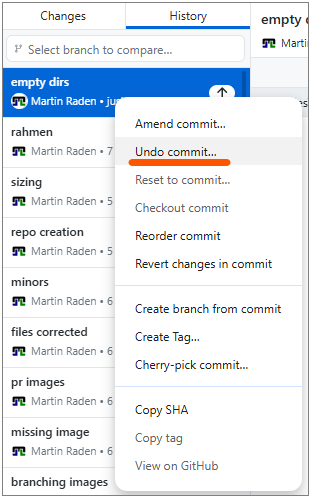
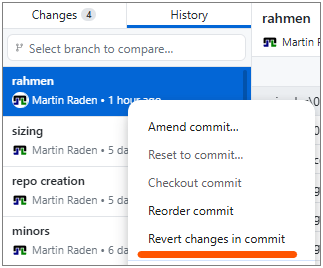

:::::::::::::::::::::::::::::::::::::: questions

- What common problems will I encounter when using git?
- How do I undo mistakes safely?
- How should I organise my repository and collaborate with others?

::::::::::::::::::::::::::::::::::::::::::::::::

::::::::::::::::::::::::::::::::::::: objectives

- Handle common git pitfalls (empty directories, wrong commits)
- Undo changes using revert, discard, and reset (beginner-safe)
- Explain the difference between public and private repositories
- Describe protected branches, collaborators, and permissions
- Use GitHub issues effectively

::::::::::::::::::::::::::::::::::::::::::::::::

## Common Problems

In the following, we will discuss some common issues that beginners encounter 
when using git and GitHub, along with practical solutions.

## Empty Directories

Git tracks **files**, not directories. If you create an empty folder, git will
ignore it.

**Workarounds:**

Thus, if you really want to keep an empty directory in your repository, 
e.g. to indicate where data files should go, you can:

- Create a "hidden" **placeholder file** called `.gitkeep` inside the directory.
  - Can be empty
  - The name `.gitkeep` is a convention (not a special git feature) to indicate
    that the file exists solely to keep the directory in version control.
  - Ensure to add and commit the `.gitkeep` file so that the directory is tracked.
- Make sure every directory contains at least **one meaningful file**.
  - For example, you could add a `README.md` inside the directory with instructions or
    descriptions.
  - This is often a better practice than using `.gitkeep`, as it provides context for
    collaborators.


:::::::::::::::: spoiler

### CLI example

```bash
# Create a directory with a placeholder file
mkdir data
touch data/.gitkeep
git add data/.gitkeep
git commit -m "Add empty data directory with .gitkeep"
```

::::::::::::::::::::::::


## Undoing Changes

It happens again and again that you make a change to a file and then realise that you made a mistake, or that you changed the wrong file. 
Or you accidentally commit a file that should not be tracked (e.g. a large data file or credentials).

In that case, you want to undo your work and restore the file to the last committed state that is clean or safe.

There are several ways to undo work in git. Here is a beginner-friendly compact
overview to be discussed subsequently.

| Situation | Action in GitHub Desktop | What happens |
|-----------|--------------------------|-------------|
| Changed a file but have not committed | In "Changes" right-click the file → **Discard changes** | File returns to the last committed state |
| Committed but have not pushed | Right-click the commit → **Undo Commit** | The commit is removed from the local repository, changes are kept in the working directory |
| Already pushed | Use **Revert Commit** and push again | A new "revert"" commit is added that undoes the commit's changes. |

### Undo Uncommitted Changes

If you have changed a file wrongly but not used git so far, things are easy.
You can simply either undo the changes (with any tool) or use the 
**Discard changes** option in the *Changes* view in GitHub Desktop.
This will restore the file to the last committed state from your local repository,
*discarding all changes* since then.

We are crossing fingers that you have not made any important changes to the file since the last commit, because they will be lost.

### Undo Committed but Local Changes

If you committed a file or changes by mistake (for example a large data file or
credentials or just nonesense changes), but have not yet pushed to GitHub, 
you can undo the commit and keep the changes in your working directory. 
This allows you to fix the mistake and then commit again.

1. **Don't panic.** The commit is only local until you push.
2. In GitHub Desktop, right-click the commit in History and choose
   [**Undo commit**](https://docs.github.com/en/desktop/managing-commits/undoing-a-commit-in-github-desktop).
   - This removes the commit but keeps the changes in your working directory, 
     allowing you to fix the mistake.
3. Add the file (pattern) to `.gitignore` so it is not tracked in the future.

{alt="Screenshot of the 'Undo commit' option in GitHub Desktop"}

**Note:** This is only possible for commits that are not yet pushed to the
remote repository (GitHub). Such "local" commits are indicated with a small
"UP"-arrow icon in GitHub Desktop. 


::::::::::::::::::::::::::::::::::::: callout

### Credentials and secrets

**Never** commit passwords, API keys, or other secrets. If you accidentally
push a secret to GitHub, consider it compromised — rotate/change the credential
immediately and remove it from the repository history.

::::::::::::::::::::::::::::::::::::::::::::::::


### Undo Already Pushed Changes

If you have already pushed a commit to the remote repository (e.g. GitHub) 
and want to undo it, you should not try to remove it from history 
(e.g. with `git reset --hard` or `git rebase`) because that can cause problems 
for collaborators who have already pulled the commit.
Instead you should push a new commit that **reverts** the changes of the previous commit.
This way, the history remains intact and collaborators can see that a change was made and then undone.

1. In GitHub Desktop, right-click the respective commit in *History* view
2. Choose **Revert changes in commit**.
   - This creates a new commit that undoes the changes introduced by the original commit.
3. Push the new revert commit to GitHub.

{alt="Screenshot of the 'Revert changes in commit' option in GitHub Desktop"}

In case you need to undo multiple commits, you can revert them one by one starting from the most recent one.
This way, you avoid merge conflicts that can arise when reverting multiple commits at once.


:::::::::::::::: spoiler

### CLI equivalents

```bash
# Situation 1: Discard changes to a file (before commit)
git checkout -- filename.md

# Situation 2: Unstage a file (keep changes but remove from staging)
git reset HEAD filename.md

# Situation 3: Revert the last commit (creates a new commit)
git revert HEAD
```

::::::::::::::::::::::::

::::::::::::::::::::::::::::::::::::: callout

### A note on rebase

You may encounter the term **rebase** in online tutorials. Rebasing rewrites
commit history and is an advanced technique. **Do not use rebase** on shared
branches unless you fully understand the implications — it can cause serious
problems for collaborators. Stick with **merge** for now.

::::::::::::::::::::::::::::::::::::::::::::::::

## Repository Visibility

| Setting | Who can see the repo | Who can contribute |
|---------|---------------------|--------------------|
| **Public** | Anyone on the internet | Only collaborators (unless forked) |
| **Private** | Only you and invited collaborators | Only collaborators |

Choose **private** for sensitive or unfinished work. Choose **public** when you
want to share your project with the world.

The visibility setting is configured when you create a repository, 
but you can also change it later in the *General* repository settings on GitHub.


## Protected Branches

Teams often **protect** the `main` branch so that:

- No one can push directly to `main`.
- All changes must go through a pull request.
- Pull requests require at least one approving review before merging.

This prevents accidental breakage on the stable branch.
Furthermore, it encourages code review and discussion before changes are integrated.

Reviewing can be bypassed by administrators for simple changes, 
but it's good practice to follow the process even if you have admin rights.

Branch protection can be set up in the repository settings on GitHub (see below). 

If you encounter an error when trying to push to `main`, 
it's likely that the branch is protected and you need to create a new branch and 
open a pull request instead.


:::::::::::::::: spoiler

### Where to configure branch protection

1. Go to your repository on GitHub.
2. Click **Settings → Branches**.
3. Under "Branch protection rules", click **Add branch ruleset**.
4. Enter `main` as the branch name pattern.
5. Check **Require a pull request before merging** and other options as needed.

::::::::::::::::::::::::


## Collaborators and Permissions

To give someone access to your **private** repository (or push access to a
public one):

1. Go to **Settings → Collaborators**.
2. Click **Add people** and search for their GitHub username.
3. Choose a permission level (Read, Write, or Admin).

That way, they can clone the repository, push changes, and collaborate with you.
Furthermore, you have full control over who can access your private repositories and what they can do.

## GitHub Issues

Issues are used to track tasks, report bugs, and discuss ideas. 

Good practices are:

- **Clear title:** summarise the problem or request in a few words.
- **Description:** explain the context, steps to reproduce (for bugs), and
  expected behaviour. You can also add screenshots or code snippets if relevant.
  It is also possible to [reference lines of code](https://docs.github.com/en/get-started/writing-on-github/working-with-advanced-formatting/creating-a-permanent-link-to-a-code-snippet) or specific commits.
- **Labels:** use labels like `bug`, `enhancement`, `question` to categorise.
- **Linking:** reference issues in commit messages or PRs using `#123` syntax.

Each issue gets a unique number (e.g. #1) and can be assigned to milestones, projects, or specific people.
The latter is especially useful in team projects to indicate who is responsible for addressing the issue.

This number can be used to link the issue to commits and pull requests, which helps to keep track of what work is being done to resolve the issue.
Thus, if your commit is solving a specific issue, you can write `Closes #1` in the commit message or PR description, and GitHub will automatically close the issue when the commit is merged.
Furthermore, respective information about the linked issue will be visible in the PR, which helps reviewers to understand the context of the changes.


## Documentation and README files

As already hinted at above, `README.md` README files are a great way to provide documentation for your project.
They are written in Markdown and rendered as HTML on GitHub.
Eventually, you may want to create a README file within each directory to explain its purpose and contents.
This is especially helpful for collaborators who are new to the project and may not be familiar with the structure.
A well-structured README can serve as a guide for navigating the repository and understanding the overall project.
It can also include instructions and guidelines for respective directories, which can be very helpful for onboarding new contributors and ensuring that everyone is on the same page regarding the project's structure and organization.

Generally, a `README.md` file should

- Provide an overview of the project/directory and its purpose.
- Explain how to use the project or its components.
- Include any necessary setup instructions or dependencies.
- Be kept up to date as the project evolves.

The central README file in the root directory can also 

- include links to other README files in subdirectories, creating a clear and navigable documentation structure for the entire project.
- provide documentation for dependencies, data sources, or other external resources that are relevant to the project.
- serve as a central hub for all project-related information, making it easier for collaborators to find what they need and understand the project's structure and goals.

Typically, the project's central `README.md` also serves as the landing page 
when exporting the repository to GitHub Pages, so it is a good place to provide an introduction and overview of the project for visitors.
This process will be discussed in more detail in the next episode on publishing and automation.


::::::::::::::::::::::::::::::::::::: challenge

## Exercise: Your Troubleshooting Checklist

Create a short checklist titled **"What to do when something went wrong"**.
Include at least five items covering the scenarios discussed above.

:::::::::::::::::::::::: solution

### Example checklist

1. **Unwanted changes to a file?** → Discard changes in GitHub Desktop.
2. **Wrong commit (not yet pushed)?** → Undo the commit in GitHub Desktop.
3. **Wrong commit (already pushed)?** → Revert and push the revert commit.
4. **Committed a secret?** → Rotate the credential immediately. Remove from
   history if possible.
5. **Empty directory not showing up?** → Add a `README.md` or `.gitkeep` file.
6. **Merge conflict?** → Open the file, resolve the markers, commit, and push.
7. **Cannot push to main?** → The branch is probably protected. Create a
   branch and open a pull request instead.

:::::::::::::::::::::::::::::::::

::::::::::::::::::::::::::::::::::::::::::::::::

::::::::::::::::::::::::::::::::::::: keypoints

- Git does not track empty directories — use `.gitkeep` as a placeholder.
- Use **Discard changes** for uncommitted edits and **Revert** for commits.
- Never commit secrets; rotate any that are accidentally pushed.
- Protected branches enforce a pull request workflow.
- Issues help organise work; use clear titles, descriptions, and labels.
- README files provide essential documentation and should be kept up to date.

::::::::::::::::::::::::::::::::::::::::::::::::
