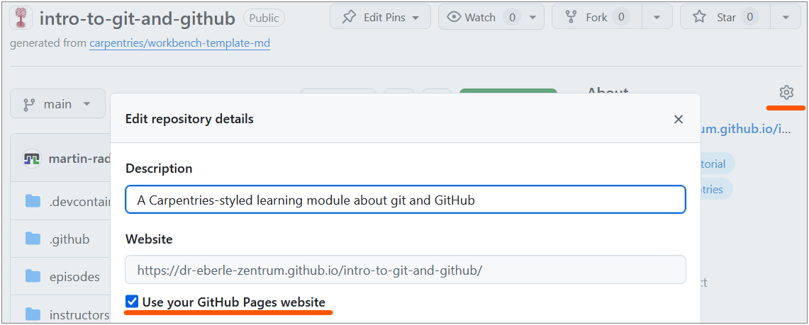
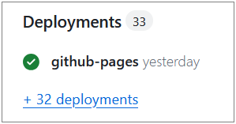
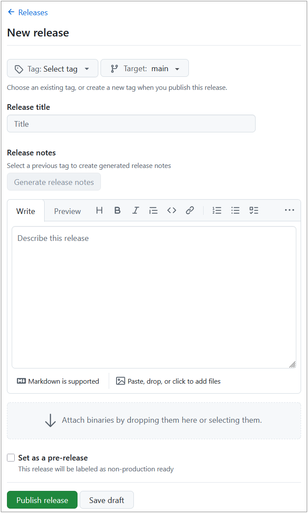

:::::::::::::::::::::::::::::::::::::: questions

- How can I publish a website from my repository?
- What are tags and releases?
- How can I automate tasks with GitHub Actions?

::::::::::::::::::::::::::::::::::::::::::::::::

::::::::::::::::::::::::::::::::::::: objectives

- Enable GitHub Pages to publish a simple site from a repository
- Create a tag and a release on GitHub
- Explain what GitHub Actions are and how workflows are triggered
- Describe how git and GitHub support FAIR and open-science principles

::::::::::::::::::::::::::::::::::::::::::::::::

## GitHub Pages

[**GitHub Pages**](https://docs.github.com/en/pages/getting-started-with-github-pages/what-is-github-pages) 
turns a GitHub repository into a website — for free. It is commonly
used for project documentation, personal portfolios, and course materials
(*like this one!*).

The generated website is hosted on GitHub's web servers and can be accessed via a URL like

- `https://USERNAME.github.io/REPO/`, replacing `USERNAME` and `REPO` respectively.
- e.g. this course' URL [https://dr-eberle-zentrum.github.io/intro-to-git-and-github/](https://dr-eberle-zentrum.github.io/intro-to-git-and-github/).

Note, website and repository content are separately maintained but linked: you edit files in the repository, 
and GitHub Pages copies and renders them as a website.

The website does only contain the files that are covered by the Pages configuration.
For instance, per default only the `README.md` is rendered as a web page, but other files (e.g. `about.md`) 
are not included in the website until you link to them from the `README.md` or create an `index.html` that includes them.
Alternatively, you can configure GitHub Pages to render all files in a specific folder (e.g. `/docs`) and/or branch, but this is not the default.
The latter is useful when page generation involves a build step as is the case for this course, which uses 
the [Carpentries Sandpaper](https://carpentries.github.io/sandpaper/) workflow to generate the website from markdown files in the repository.

An important note: GitHub Pages only supports **static websites** — meaning they cannot run server-side code (e.g. Python, PHP).
Serving and including client-side JavaScript code from your repository is possible.
This makes GitHub Pages ideal for simple project documentation, portfolios, and course materials, but not suitable for dynamic web applications.

But beware, GitHub (Pages) is *not a long-term archive*.
While repositories can be part of GitHub's archiving program, it is recommended to use a dedicated archive (e.g. Zenodo) for long-term preservation of research outputs.
The same holds for websites published with GitHub Pages: they are not guaranteed to be preserved indefinitely, so consider using a web archiving service (e.g. Internet Archive) for important pages.


### Enabling GitHub Pages

1. Go to your repository on GitHub.
2. Click **Settings → Pages**.
3. Under **Source**, select the branch (e.g. `main`) and folder (`/ (root)` or
   `/docs`).
4. Click **Save**.
5. After a short build, your site will be available at
   `https://USERNAME.github.io/REPO/`.


### Using GitHub Pages URL in Project Description

When using GitHub Pages to serve a well styled documentation or project website,
it is typically a good idea to include the URL of the published site in the repository's description.
The easiest way is to use the *About* section on the right sidebar of the repository's main page.

{alt="Screenshot of the 'About' section in the right sidebar of a GitHub repository, showing how to add a description and website URL."}

The dialog, shown above, allows you to add a short description of your project and a URL, or most easy, to use the GitHub Pages output URL.


### Checking the build process

The build process for GitHub Pages can take a few minutes. 
If your site doesn't appear or update immediately, wait a bit and refresh the page. 
You can also check the build status in the repository's **Actions** tab, where you may find logs if there are issues with the build.

Alternatively, the build status is reported in the **Deployments** section of the repository's main page's right sidebar, where you can also find logs for troubleshooting.

{alt="Screenshot of the 'Deployments' section in the right sidebar of a GitHub repository, showing the status of GitHub Pages builds and links to logs."}


::::::::::::::::::::::::::::::::::::: callout

### Minimal site from a README

The quickest way to get a Pages site is to write your content in `README.md`.
GitHub Pages will render it as HTML automatically. For more control, you can
use a static site generator like Jekyll (GitHub's default) or create your own
HTML files.

::::::::::::::::::::::::::::::::::::::::::::::::


## GitHub Actions (Introduction)

**GitHub Actions** let you automate tasks that run whenever something happens
in your repository — for example, when you push a commit or open a pull
request.
The introduced GitHub Pages feature is an example of a GitHub Action that runs on every push to the `main` branch to build and deploy the website.
You can create your own custom actions to automate tasks like running tests, checking code style, or even deploying your project to a server.

### What is a workflow?

A **workflow** is an automated process defined in a YAML file inside the
`.github/workflows/` directory of your repository. 
(If you have never heard about YAML yet, you might want to [check out this YAML introduction](https://www.redhat.com/en/topics/automation/what-is-yaml))
Each workflow contains one or more **jobs**, and each job contains one or more **steps**.

### When does a workflow run?

Workflows are triggered by **events**, such as:

- `push` — when commits are pushed to a branch (e.g. GitHub Pages deployment).
- `pull_request` — when a PR is opened or updated (e.g. to check spelling).
- `schedule` — on a cron schedule (e.g. nightly).
- `workflow_dispatch` — manually triggered from the Actions tab on GitHub.


### Example: spell-checking with GitHub Actions

A simple spell-check workflow using [cspell-action](https://github.com/streetsidesoftware/cspell-action) 
can catch typos automatically:

```yaml
# Workflow to enable spell-checking on pull requests to main
---

name: Spell Check

on: # any PRs on main branch
  pull_request:
    branches: [main]

jobs:
  spellcheck: # run the action
    runs-on: ubuntu-latest
    steps:
      - uses: actions/checkout@v5
        with:
          persist-credentials: false
      - uses: streetsidesoftware/cspell-action@v8
```

This workflow:

1. Triggers on every pull request to the `main` branch.
2. Checks out the repository code.
3. Runs [cspell](https://github.com/streetsidesoftware/cspell) to find
   spelling errors.
4. Reports any issues directly in the pull request, making it easy to fix typos before merging.

For more actions, browse the
[GitHub Marketplace](https://github.com/marketplace?type=actions).

<!-- TODO: add screenshot of a passing GitHub Actions run on the Actions tab -->

:::::::::::::::: spoiler

### Where to place the workflow file

```bash
# Create the workflows directory
mkdir -p .github/workflows

# Create the workflow file
cat > .github/workflows/spellcheck.yml << 'EOF'
name: Spell Check
on:
  pull_request:
    branches: [main]

jobs:
  spellcheck:
    runs-on: ubuntu-latest
    steps:
      - uses: actions/checkout@v4
      - uses: streetsidesoftware/cspell-action@v6
EOF

git add .github/workflows/spellcheck.yml
git commit -m "Add spell-check workflow"
git push
```

::::::::::::::::::::::::

::::::::::::::::::::::::::::::::::::: challenge

## Exercise: What Is a Workflow?

In your own words, explain:

1. What is a GitHub Actions **workflow**?
2. When does it **run**?
3. Give one example of a useful workflow for your own project.

:::::::::::::::::::::::: solution

### Example answers

1. A **workflow** is an automated process defined in a YAML file that tells
   GitHub what tasks to perform (e.g. run tests, check spelling).
2. It **runs** when a specified event occurs — such as pushing code, opening a
   pull request, or on a schedule.
3. Examples: run a spell checker on every PR, build a website on every push to
   `main`, run unit tests before merging.

:::::::::::::::::::::::::::::::::

::::::::::::::::::::::::::::::::::::::::::::::::


## Tags and Releases

### Tags

Tagging is a central feature of git that allows you to mark important points in your project's history, such as releases or milestones.
Eventually, a **tag** is a label attached to a specific commit, typically used to mark
version numbers (e.g. `v1.0.0`).


:::::::::::::::: spoiler

### CLI equivalents

```bash
# Create an annotated tag
git tag -a v1.0.0 -m "First stable release"

# Push tags to GitHub
git push --tags
```

::::::::::::::::::::::::


### Releases

A **release** is a GitHub feature built on top of tags. It adds:

- Release notes describing what changed.
- Downloadable archives (`.zip`, `.tar.gz`).
- Optional binary attachments.

### Creating a release on GitHub

1. Go to your repository and click **Releases** (in the right sidebar).
2. Click **Draft a new release**.
3. Enter/Choose a tag (e.g. `v1.0.0`) and a title.
4. Write release notes summarising the changes.
5. Click **Publish release**.

{alt="Screenshot of the 'Draft a new release' page on GitHub, showing fields for tag version, release title, and release notes."}

In contrast to tags, releases can be enriched with additional information and assets, 
making them more informative and user-friendly for end-users who want to understand 
the changes and download specific versions of the project.

A release typically provides a ZIP or tarball archive of the whole repository at the tagged commit, which can be downloaded by users without needing to clone the repository or use git commands.
Furthermore, release information can be accessed via respective URLs making it easier to share specific versions of the project with others.


## Zenodo Archiving and DOI

[Zenodo](https://zenodo.org/) is a research data repository that integrates
with GitHub. By linking your repository to Zenodo, every release automatically
gets a **DOI** (Digital Object Identifier) — making your work citable in
academic publications and archived within Zenodo's long-term preservation system.

### Quick setup

1. Go to [zenodo.org](https://zenodo.org/) and log in with your GitHub account.
2. Enable the repository you want to archive.
3. Create a release on GitHub — Zenodo will automatically archive it and assign
   a DOI.


## GitHub for Science

Git and GitHub support several principles that are important in research:

| Principle | How GitHub helps |
|-----------|-----------------|
| **Reproducibility** | Every version is tracked; collaborators can reproduce results from any point in time. |
| **Transparency** | Public repositories let anyone inspect the work. |
| **Collaboration** | Issues, pull requests, and reviews enable structured teamwork. |
| **Archiving** | Zenodo integration provides long-term preservation with DOIs. |
| **FAIR data** | Repositories can be Findable, Accessible, Interoperable, and Reusable when properly documented. |

::::::::::::::::::::::::::::::::::::: callout

### Limitations

- GitHub is **not** a long-term archive by itself — use Zenodo or a
  discipline-specific repository for preservation.
- Large binary files (datasets, images) are not handled well by git. Consider
  [Git LFS](https://git-lfs.github.com/) for large files.
- Private repositories limit transparency; consider making repos public when
  the work is published.

::::::::::::::::::::::::::::::::::::::::::::::::

## Alternatives to GitHub

| Platform | Notes |
|----------|-------|
| [GitLab](https://gitlab.com/) | Self-hostable, integrated CI/CD |
| [Bitbucket](https://bitbucket.org/) | Atlassian ecosystem integration |
| [Codeberg](https://codeberg.org/) | Non-profit, community-driven |
| [SourceHut](https://sourcehut.org/) | Minimalist, email-driven workflow |

All of these use **git** under the hood, so your skills transfer directly.


::::::::::::::::::::::::::::::::::::: keypoints

- GitHub Pages publishes a website directly from your repository.
- Tags mark specific commits; releases add notes and downloadable archives.
- Zenodo can archive GitHub releases and assign DOIs for academic citation.
- GitHub Actions automate tasks (testing, building, checking) triggered by
  repository events.
- A workflow is a YAML file in `.github/workflows/` that defines automated jobs.

::::::::::::::::::::::::::::::::::::::::::::::::
