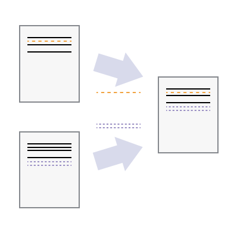
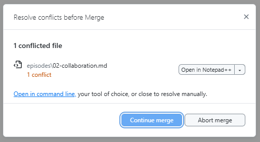
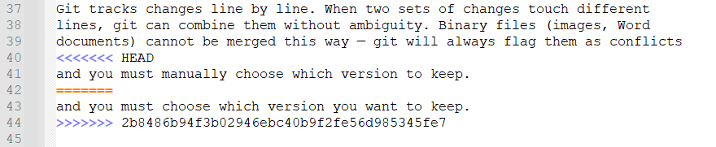

:::::::::::::::::::::::::::::::::::::: questions

- How can multiple people work on the same project without overwriting each
  other's changes?
- What is a branch and why should I use one?
- What is a pull request?

::::::::::::::::::::::::::::::::::::::::::::::::

::::::::::::::::::::::::::::::::::::: objectives

- Explain how concurrent changes are merged automatically
- Describe what a merge conflict is and when it occurs
- Create and switch between branches in GitHub Desktop
- Open a pull request on GitHub and request a review

::::::::::::::::::::::::::::::::::::::::::::::::

## Working Together on the Same Project

When you are not the sole contributor to a project, multiple people will be making
changes to the remote directory.
Thus, while you are working on your local copy, 
someone else might be changing the some files of the project on their local copy 
and pushing those changes to the remote repository.
When you are done with your changes and commited them to *your* local copy,
your local repository will be both outdated and ahead of the remote repository at the same time!

That is
- the remote repository has changes that you don't have (because someone else pushed them), and
- your local repository has changes that the remote repository doesn't have (because you haven't pushed them yet).

Therefore, git will refuse to push your changes until you have integrated the remote changes into your local copy.
When using GitHub Desktop, you will see the following notification.

{alt='A screenshot of GitHub Desktop showing a notification that says "Your branch is out of date with the remote branch. Please pull the latest changes before pushing."'}

When pulling, git will try to automatically integrate the remote changes into your local repository.
That is, all changes that are made to different files pose no problems.
Problems can occur when two people edit the same file at the same time.

When the two people edit **different parts** of the **same file**,
git can usually merge their changes automatically. This is called an
**auto-merge** and works best with plain-text files (Markdown, code, CSV, XML, HTML, ...).

{alt='A diagram that shows the merging of two different document versions into one document that contains all of the changes from both versions' width="40%"}

::::::::::::::::::::::::::::::::::::: callout

### Why text files merge well

Git tracks changes line by line. When two sets of changes touch different
lines, git can combine them without ambiguity. Binary files (images, Word
documents) cannot be merged this way — git will always flag them as conflicts
and you must manually choose which version to keep.

**So whenever possible, use text-based file formats for your files to take advantage of git's powerful merging capabilities.**

::::::::::::::::::::::::::::::::::::::::::::::::


## Merge Conflicts

In case the remote repository's changes overlap with your local changes, git cannot automatically merge them. 
Thus, GitHub Desktop will show a notification that says "This branch has conflicts that must be resolved" as follows.

{alt='A screenshot of GitHub Desktop showing a notification that says "This branch has conflicts that must be resolved"'}

In that case, a so called **merge conflict** occurs.

A **merge conflict** happens when two people change the **same line(s)** of the
same file. Git cannot decide which version to keep, so it asks *you* to choose.

{alt='A diagram that shows two different document versions that both change the same line, resulting in a conflict that cannot be automatically resolved' width="60%"}


### What a conflict looks like

The dialog from above allows you to use an external editor to resolve the conflict.
This is possible because git marks the conflicting sections in the file with special markers.

{alt='A screenshot of a text editor showing a merge conflict with the conflict markers highlighted'}

When a conflict occurs, git marks each affected section in the file:

```text
<<<<<<< HEAD
This is my version of the line.
=======
This is the other person's version.
>>>>>>> branch-name
```

- Everything between `<<<<<<< HEAD` and `=======` is **your** change.
- Everything between `=======` and `>>>>>>>` is the **other** change.

### Resolving a conflict

1. Open the file and find the conflict markers (e.g. searching for "<<<<").
2. Decide which version to keep (or combine both).
3. Delete the conflict markers (`<<<<<<<`, `=======`, `>>>>>>>`).
4. Save, commit, and push.

As stated above, in GitHub Desktop, conflicted files are highlighted and you can open them
directly in your editor to resolve the conflict.
Within IDEs like RStudio, the same markers appear and you can use the IDE's built-in editors to resolve the conflict.


:::::::::::::::: spoiler

### CLI equivalents

```bash
# After a pull or merge that causes a conflict
git status          # shows conflicted files

# After manually editing the file to resolve the conflict
git add filename.md
git commit -m "Resolve merge conflict in filename.md"
git push
```

::::::::::::::::::::::::

## Branching

A **branch** is a parallel line of development. Instead of committing directly
to `main`, you create a branch, make your changes there, and merge them back
when they are ready.

<!-- TODO: add diagram showing main branch with a feature branch splitting off and merging back -->

### Why use branches?

- **Safety:** your work-in-progress does not affect the stable `main` branch.
- **Collaboration:** each person (or feature) gets its own branch.
- **Review:** branches make it easy to review changes before they are merged.

### Creating a branch in GitHub Desktop

1. Click the **Current branch** dropdown in the toolbar.
2. Click **New branch**.
3. Enter a descriptive name (e.g. `add-goals-section`).
4. Click **Create branch**.

You are now working on the new branch. All commits you make will go here
instead of `main`.

<!-- TODO: add screenshot of the "New branch" dialog in GitHub Desktop -->

### Switching branches

Use the **Current branch** dropdown to switch between branches. GitHub Desktop
will update your files to match the selected branch.

:::::::::::::::: spoiler

### CLI equivalents

```bash
# Create and switch to a new branch
git checkout -b add-goals-section

# List all branches
git branch

# Switch to an existing branch
git checkout main

# Merge a branch into main
git checkout main
git merge add-goals-section
```

::::::::::::::::::::::::

## Pull Requests

A **pull request** (PR) is a proposal to merge changes from one branch into
another (typically into `main`). Pull requests are created on GitHub and
provide a space for:

- **Code review:** team members can read the changes line by line.
- **Discussion:** ask questions, suggest improvements, leave comments.
- **Approval:** reviewers approve or request changes before merging.

<!-- TODO: add screenshot of a pull request page on GitHub showing the conversation tab -->

### Opening a pull request

1. Push your branch to GitHub (GitHub Desktop will offer a **Publish branch**
   button).
2. GitHub Desktop shows a prompt: **Create Pull Request**. Click it to open
   the GitHub website.
3. Fill in a title and description, then click **Create pull request**.

<!-- TODO: add screenshot of the "Create pull request" form on GitHub -->

### Reviewing and merging a pull request

1. On the PR page, go to the **Files changed** tab to review the diff.
2. Add comments or approve the changes.
3. When ready, click **Merge pull request** and then **Confirm merge**.

<!-- TODO: add screenshot of the "Merge pull request" button on GitHub -->

:::::::::::::::: spoiler

### CLI equivalent for pushing a branch

```bash
# Push a new branch to GitHub
git push -u origin add-goals-section
```

After pushing, you create the pull request via the GitHub web interface.

::::::::::::::::::::::::

::::::::::::::::::::::::::::::::::::: challenge

## Exercise: Branch vs Main

Explain the difference between:

- committing directly to `main`, and
- committing on a feature branch and creating a pull request.

When would you prefer one approach over the other?

:::::::::::::::::::::::: solution

### Key difference

- **Committing to main** is quick but risky — mistakes go live immediately
  and there is no review step.
- **Feature branch + PR** adds a review step and keeps `main` stable. This
  is the recommended workflow for any collaborative project.

**Use main directly** only for small solo projects or trivial fixes (e.g.
fixing a single typo).

:::::::::::::::::::::::::::::::::

::::::::::::::::::::::::::::::::::::::::::::::::

::::::::::::::::::::::::::::::::::::: keypoints

- Git can auto-merge changes to different parts of a file.
- A merge conflict occurs when the same lines are changed by two people.
- Branches let you work in parallel without affecting `main`.
- Pull requests provide a review and discussion workflow before merging.

::::::::::::::::::::::::::::::::::::::::::::::::
