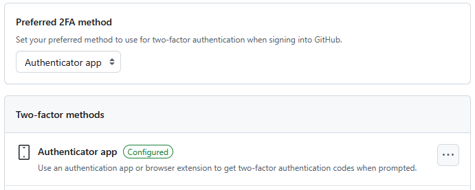
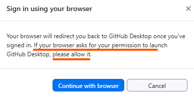
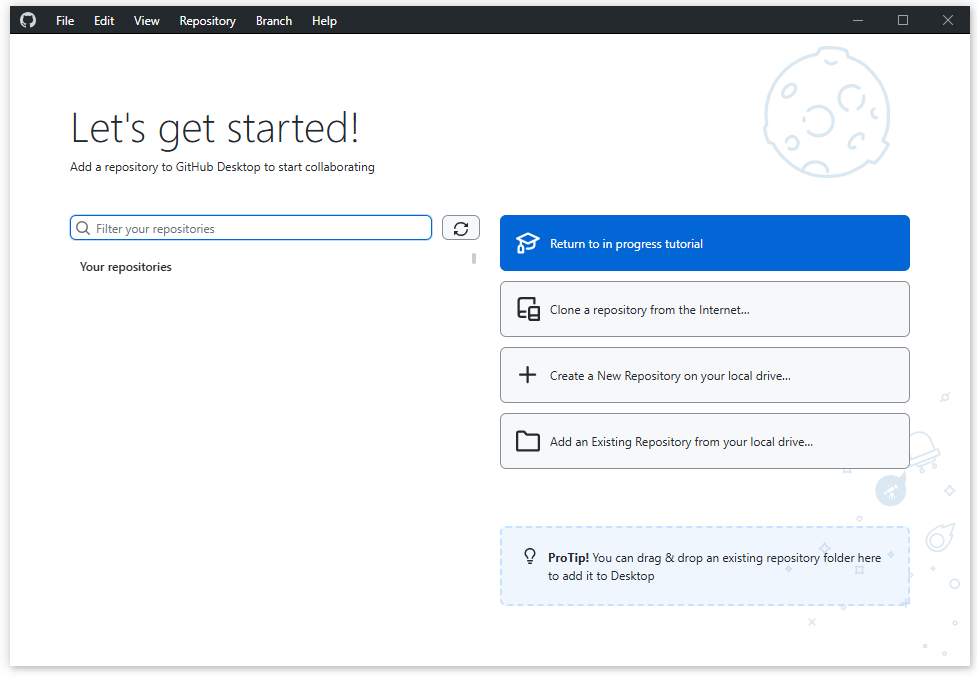

## Overview

Before the first session, please complete the following setup steps.
This should take about **20–40 minutes**.

## 1. GitHub Account

If you do not already have a GitHub account, register for free at
[github.com](https://github.com/).

### Enable Two-Factor Authentication (2FA)

Two-factor authentication is **required** for many organisational repositories,
for security-relevant settings and is strongly recommended for every account.

1. After login, go to [github.com/settings/security](https://github.com/settings/security).
2. Under "Two-factor authentication", click **Enable**.
3. Follow the prompts (authenticator app or SMS).
   - We recommend using an authenticator app (e.g. Google Authenticator, Authy) for better security.
4. Save your recovery codes in a safe place (e.g. password manager, print-out, ...) in case you lose access to your 2FA device.

At the end, it should look like this:

{alt='GitHub 2FA settings' width='80%' }

## 2. Install GitHub Desktop

GitHub Desktop is the graphical git interface we will use throughout this workshop.

:::::::::::::::: spoiler

### Windows / macOS

1. Download GitHub Desktop from <https://github.com/apps/desktop>.
2. Run the installer and follow the on-screen instructions.
3. Open GitHub Desktop and sign in with your GitHub account.

::::::::::::::::::::::::

:::::::::::::::: spoiler

### Linux (Ubuntu)

GitHub Desktop is not officially supported on Linux, but a community build is
available:

1. Follow the instructions at
   <https://linuxcapable.com/how-to-install-github-desktop-on-ubuntu-linux/>.
2. Open GitHub Desktop and sign in with your GitHub account.

::::::::::::::::::::::::

## 3. Sign In to GitHub Desktop

Signing in allows GitHub Desktop to access your repositories and perform git operations on your behalf.
The first time you open GitHub Desktop, you will be prompted to sign in to your GitHub account.

1. Open GitHub Desktop and sign in with your GitHub account on startup. 

If you skipped that step, you can sign in later:

2. Go to **File → Options** (Windows) or **GitHub Desktop → Preferences** (macOS).
  - Under the **Accounts** tab, sign in to your GitHub.com account.

{alt='GitHub Desktop sign-in message' width='80%' }

**Note:** the sign-in process opens a browser window to authenticate with GitHub.
During the process, you will be asked for permission to allow GitHub Desktop to access your account. This is necessary for GitHub Desktop to perform actions on your behalf, which is essential for its functionality. 
After successful authentication, you need to allow the browser to return to GitHub Desktop to complete the sign-in process.


## 4. Configure Your Identity

Git needs to know your name and email so it can label your commits.
These information are typically copied from your GitHub account, so make sure to use the same email address.

Alternatively, you can later set and change these values in GitHub Desktop:

1. In GitHub Desktop, go to **File → Options → Git** (Windows) or
   **GitHub Desktop → Preferences → Git** (macOS).
2. Enter your **Name** and **Email** (use the same email as your GitHub account).


:::::::::::::::: spoiler

### CLI equivalent

If you prefer or need to set this via the command line:

```bash
git config --global user.name "Your Name"
git config --global user.email "your.email@example.com"  # use the same email as your GitHub account
```

::::::::::::::::::::::::

## 5. Verify Your Setup

- [ ] GitHub account registered
- [ ] 2FA enabled
- [ ] GitHub Desktop installed
- [ ] Signed into GitHub Desktop
- [ ] Name and email configured in GitHub Desktop

Your GitHub Desktop should now be ready to use for the workshop exercises and look like this:

{alt='GitHub Desktop main window' width='100%' }


::::::::::::::::::::::::::::::::::::: callout

### Confirmation

Take a screenshot of your GitHub Desktop Account Settings (showing you are signed
in) or simply confirm to your instructor that everything is ready.

::::::::::::::::::::::::::::::::::::::::::::::::

